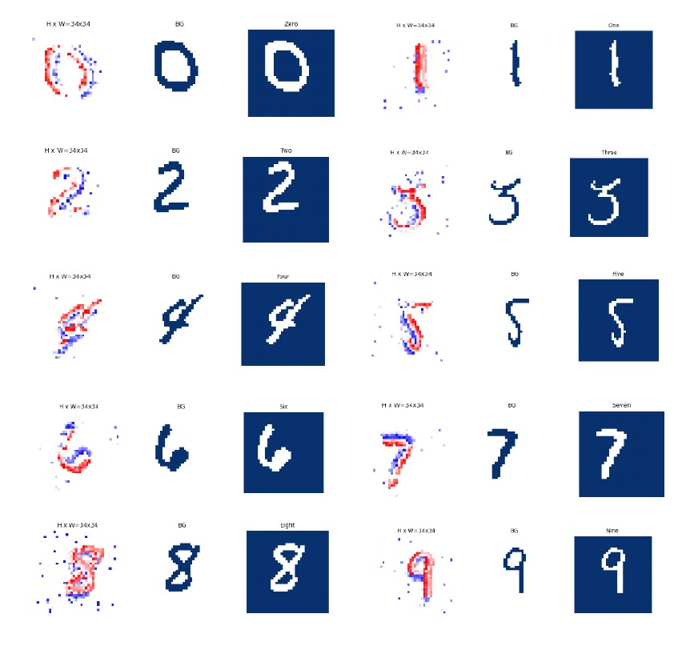

# Instance Segmentation

Instance segmentation in event-based videos (Research project). [Paper here](https://www.overleaf.com/read/cdgfmcgsjkpp).

For this project we are currently using: Python 3.8.12, Miniconda3 and Pytorch. This is because it should be compatible with [HPC](https://gitlab.tudelft.nl/pattern-recognition-and-bioinformatics/wiki/-/wikis/HPC-quickstart-guide) so we can make use of training the models on it.

Required background knowledge:
- What is an event-based camera? [Link1](https://www.youtube.com/watch?v=MjX3z-6n3iA), [Link2](https://www.youtube.com/watch?v=6xOmo7Ikwzk&ab_channel=Sony)
- Basic Machine Learning (ML) knowledge and what is a neural network (NN)? [3b1b playlist](https://www.youtube.com/playlist?list=PLZHQObOWTQDNU6R1_67000Dx_ZCJB-3pi)
- Basic Pytorch knowledge. [60min tutorial](https://pytorch.org/tutorials/beginner/deep_learning_60min_blitz.html)
- Image Processing and Computational Intelligence knowledge from courses like CSE2225 and CSE2530.

## Setting up Miniconda (for Windows only)

Make a Virtual environment with Miniconda3 by following this [youtube tutorial](https://www.youtube.com/watch?v=1gtHso20YMQ&ab_channel=CharlBotha).

In miniconda command line:
```
conda create --name instance_segmentation python=3.8.12  
conda info --envs  
conda activate instance_segmentation  
```

Hopefully just running the following command should work:
```
pip install -r requirements.txt
```

<details>
  <summary>Otherwise check this section!</summary>
  


For Pytorch
```
conda install astunparse numpy ninja pyyaml mkl mkl-include setuptools cmake cffi typing_extensions future six requests dataclasses
conda install -c conda-forge libuv=1.39
pip3 install torch==1.8.1+cpu torchvision==0.9.1+cpu torchaudio===0.8.1 -f https://download.pytorch.org/whl/torch_stable.html
```


Data visualization:  
```
pip install tonic
pip install matplotlib
```

OpenCV:
```
python3.8 -m pip install opencv-python
```

```
pip install scikit-image
```

[comment]: <> (pip freeze > requirements.txt)
</details>

<details>
  <summary>If Mask R-CNN is acting up read this!</summary>

[Working fork of Mask R-CNN TF2](https://github.com/alsombra/Mask_RCNN-TF2) - working as of May 2022
[Official Mask R-CNN](https://github.com/matterport/Mask_RCNN) - was not working with installed setup

For h5py:
```
pip uninstall h5py
conda install -c anaconda h5py
```

For imgaug:
```
pip3 install imgaug
```

For pycocotools:
```
pip install cython
pip install git+https://github.com/philferriere/cocoapi.git#egg=pycocotools^&subdirectory=PythonAPI
```

For scipy:
```
pip install -U scikit-image==0.16.2
```

For wandb:
```
pip install wandb
```

</details>

## Running 1 digit
1. Change settings in `src/main.py` to generate the datasets or use the already generated datasets from `data/`.
2. Change paths to correct datasets in `src/dvs_training.py`, make sure the `DETECTION_MAX_INSTANCES` from `src/mrcnn/config.py` is set to 1.
3. From `src/dvs_training.py`, make sure the `init_with` variable is set to `coco` if training from scratch or set it to `last` to continue training some previous model.
4. Run `src/dvs_training.py`, wait until finished, setup similar paths in `src/dvs_testing.py` and run it. Plots should be generated and the results in terms of Accuracy, MIoU and mAP will be displayed when it finishes running.

## Running multiple digits
1. Make sure the `DETECTION_MAX_INSTANCES` from `src/mrcnn/config.py` is set to 4 (or if you change the generation of multiple digits, set it to how many digits there are).
2. Similar to "Running 1 digit", but for generating the dataset, you only need to generate it the first time when running `src/dvs_training_multiple.py`, so afterwards you can set `REGENERATE` to `False` from `src/dvs_dataset_multiple.py`.
3. Run `src/dvs_training_multiple.py` and then run `src/dvs_testing_multiple.py`.

## Visuals
Generated training masks  


[//]: # (GIF with training masks overlayed?)

Predictions


## Roadmap
W1 starting on 19/04/2022, presentation on 22/06/2022, documented [here](https://www.overleaf.com/read/dmgtfpdqtxrr).

## Authors and acknowledgment
Author: Ana Băltărețu  
Supervisors: Nergis Tömen, Ombretta Strafforello, Xin Liu

## Related work
1. [N-MNIST dataset](https://www.garrickorchard.com/datasets/n-mnist)
2. [Mask R-CNN](https://openaccess.thecvf.com/content_ICCV_2017/papers/He_Mask_R-CNN_ICCV_2017_paper.pdf)
3. [Splash of Color: Instance Segmentation with Mask R-CNN and TensorFlow](https://engineering.matterport.com/splash-of-color-instance-segmentation-with-mask-r-cnn-and-tensorflow-7c761e238b46)
4. [Matterport3D: Learning from RGB-D Data in Indoor Environments](https://arxiv.org/pdf/1709.06158.pdf)
5. [EV-SegNet: Semantic Segmentation for Event-based Cameras](https://arxiv.org/pdf/1811.12039.pdf)
6. [EvDistill: Asynchronous Events to End-task Learning via Bidirectional Reconstruction-guided Cross-modal Knowledge Distillation](https://openaccess.thecvf.com/content/CVPR2021/papers/Wang_EvDistill_Asynchronous_Events_To_End-Task_Learning_via_Bidirectional_Reconstruction-Guided_Cross-Modal_CVPR_2021_paper.pdf)
7. [Event-based Vision: A Survey](https://arxiv.org/pdf/1904.08405.pdf)
8. [A 128x128 120 dB 15 μs Latency Asynchronous Temporal Contrast Vision Sensor](https://ieeexplore.ieee.org/stamp/stamp.jsp?tp=&arnumber=4444573&tag=1)
9. [A 640×480 Dynamic Vision Sensor with a 9μm Pixel and 300Meps Address-Event Representation](https://ieeexplore.ieee.org/stamp/stamp.jsp?tp=&arnumber=7870263)
10. [Contour Detection and Characterization for Asynchronous Event Sensors](https://www.cv-foundation.org/openaccess/content_iccv_2015/papers/Barranco_Contour_Detection_and_ICCV_2015_paper.pdf)
11. [Gradient-Based Learning Applied to Document Recognition](https://ieeexplore.ieee.org/stamp/stamp.jsp?tp=&arnumber=726791)
12. [DDD17: End-To-End DAVIS Driving Dataset](https://arxiv.org/pdf/1711.01458.pdf)
13. [End-to-End Learning of Representations for Asynchronous Event-Based Data](https://openaccess.thecvf.com/content_ICCV_2019/papers/Gehrig_End-to-End_Learning_of_Representations_for_Asynchronous_Event-Based_Data_ICCV_2019_paper.pdf)
14. [Faster R-CNN: Towards Real-Time Object Detection with Region Proposal Networks](https://proceedings.neurips.cc/paper/2015/file/14bfa6bb14875e45bba028a21ed38046-Paper.pdf)
15. [A Survey on Performance Metrics for Object-Detection Algorithms](https://ieeexplore.ieee.org/stamp/stamp.jsp?tp=&arnumber=9145130)
16. [Microsoft COCO: Common Objects in Context](https://link.springer.com/content/pdf/10.1007/978-3-319-10602-1_48.pdf)
17. [mAP (mean Average Precision) for Object Detection](https://jonathan-hui.medium.com/map-mean-average-precision-for-object-detection-45c121a31173)
18. [Deep Residual Learning for Image Recognition](https://openaccess.thecvf.com/content_cvpr_2016/papers/He_Deep_Residual_Learning_CVPR_2016_paper.pdf)


## License
MIT License
Copyright (c) 2022 Ana Băltăreţu

